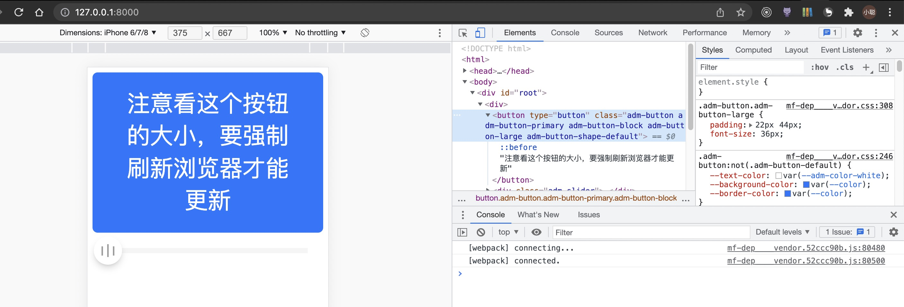
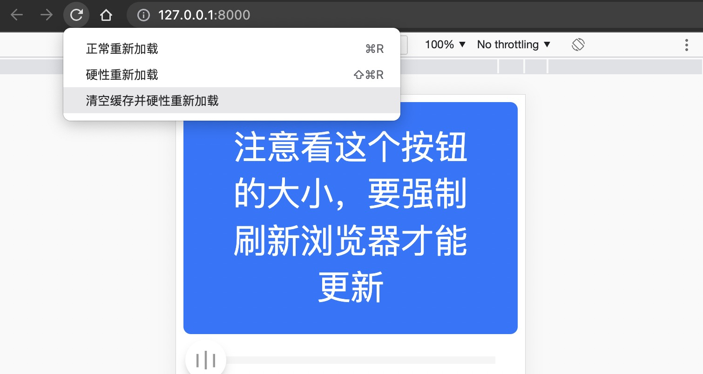
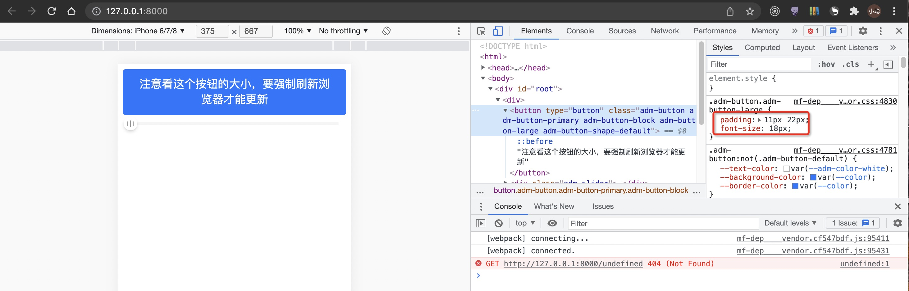

# mfsu-cache-bug

bug 演示分支，请勿做任何合并操作。

@umijs/plugins/antdmobile 只是为了掩饰保留的最简重现，实际功能并不完整。

## 步骤

1、 pnpm i && pnpm build
2、 cd examples/bug-mfsu-cache && pnpm dev
3、 访问 http://127.0.0.1:8000/



> font-size:36px

4、修改 .umirc.ts

```diff
export default {
  plugins: ['@umijs/plugins/dist/antdmobile'],
  // 启动项目之后更新这个配置，注释或者放开注释
  // 需要强制刷新浏览器才会更新页面
-  hd: {}
+  // hd: {}
};
```

5、等待项目自动重启（手动重启ctrl c + pnpm dev)

强制删除 mfsu 缓存也是一样的效果（rm -rf .mfsu && umi dev）

6、访问 http://127.0.0.1:8000/，刷新页面（command + r）都没有变化。

7、清空缓存并硬性重新加载



8、页面正确更新



> font-size:18px
